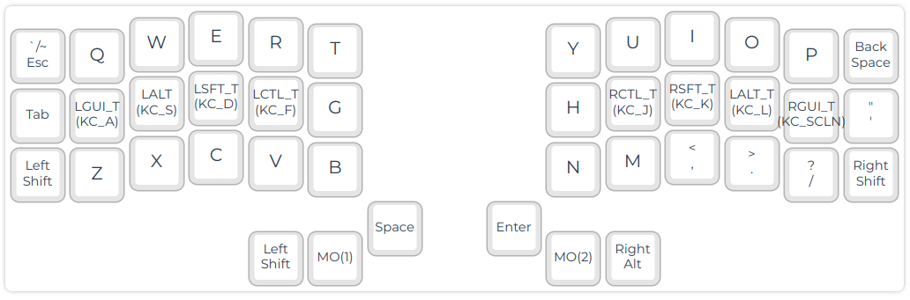
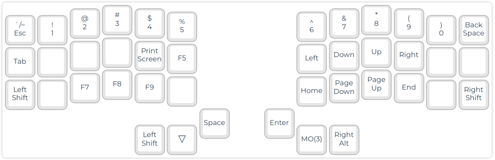
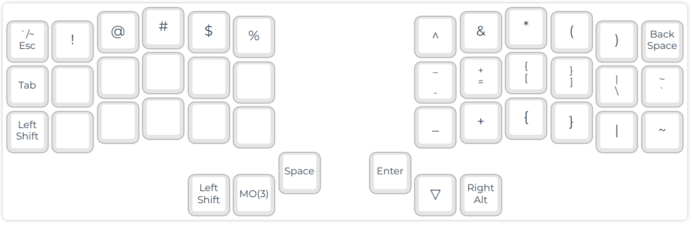
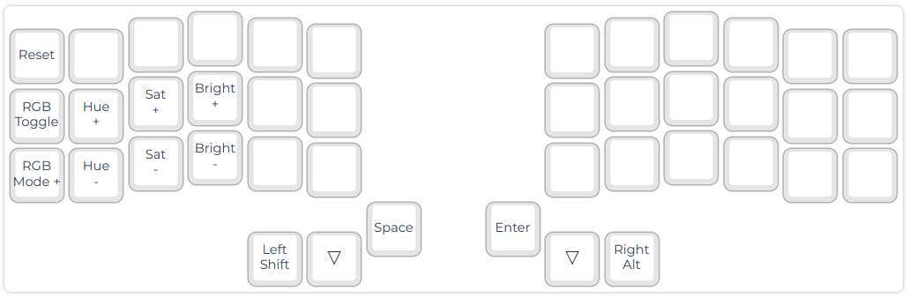

# qmk_aurora_linux_dev

# Aurora Corne's Linux_dev Keymap

_This keymap is based on the [Aurora Corne default keymap](https://github.com/qmk/qmk_firmware/tree/master/keyboards/splitkb/aurora/corne/keymaps/default)
(which is a copy of the [Corne default keymap](https://github.com/qmk/qmk_firmware/tree/master/keyboards/crkbd/keymaps/default))._

## Overview
This keymap intends to be a confortable keymap for linux developers. I mainly
work with jvm (Scala) and Python, so I'll prioritize both charsets.

The second one is personalized to increase the confort with some cool features.

## Layers
The homing thumb fingers are used to access the different layers.

* The homing left thumb finger gives access to the Numbers (or lower) layer
* The homing right thumb finger gives access to the Symbols (or raise) layer
* Pressing both homing thumb fingers gives access to the Adjust layer

### Layer QWERTY: Base layer 1

Base layer where the common coding and writing characters are. It implements the
following features:

* `HomeRow Mods` (GUI - ALT - SHIFT - CTRL order)https://precondition.github.io/home-row-mods
* `Supr` in `Shift` + `BackSpace`
* Double `LShift` to `CapsWord`. We can reverse it by pressing `LShift` again. https://docs.qmk.fm/#/feature_caps_word

### Layer 1: Lower

The Lower layer gives access to your number keys on the top row. It also exposes
the arrow keys in the usual Vim-style layout and, under them their related .

### Layer 2: Raise

The Raise layer gives access to the symbols. In addition to shifted number keys on the top row, the right hand also exposes the remaining symbol keys, both as shifted and non-shifted variants.

### Layer 3: Adjust

The Adjust layer exposes RGB adjustment keys on the left hand.
